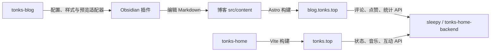

# Sleepy · Tonks Home Backend

为 Tonks 主页与博客提供共享数据的 Python API 服务：从设备在线状态、日历与音乐，到文章统计、评论、段评和桌宠 AI。前端独立发布，动态数据由后端持久化。

[API 文档](API文档.md) · [代码地图](docs/PROJECT_MAP.md) · [部署与回退](docs/DEPLOYMENT.md) · [本地验收](docs/REFACTOR_VALIDATION.md) · [邮件通知](docs/EMAIL_NOTIFICATIONS.md)

## 项目地图

这四个项目共同组成 Tonks 的个人站点与写作工具，各自保留独立仓库、依赖与发布流程。按需要克隆即可，无需额外的总仓库。

| 项目 | 职责 | 使用入口 |
| --- | --- | --- |
| [tonks-home](https://github.com/DrTonks/tonks-home) | 个人主页、状态卡片、音乐与桌宠交互 | [tonks.top](https://tonks.top/) |
| [tonks-blog](https://github.com/DrTonks/tonks-blog) | 文章、主题、静态构建与博客预览适配器 | [blog.tonks.top](https://blog.tonks.top/) |
| [tonks-home-backend](https://github.com/DrTonks/tonks-home-backend) | 主页与博客共享的状态、统计、评论等 API | 源码目录常用名 `sleepy` |
| [tonks-obsidianEditor](https://github.com/DrTonks/tonks-obsidianEditor) | Obsidian 格式插入、表单与按需博客预览 | 安装到博客 `src/content/.obsidian/plugins/tonks-blog-tools/` |



博客可单独构建静态页面；动态互动需要后端。Obsidian 插件是可选的本地写作工具，不参与线上服务，也不要求启动 Astro。博客仓库的本地目录沿用 `blogExample`，与 GitHub 上的 `tonks-blog` 是同一个项目。

个人使用的纯 API Flask 后端：接收设备状态上报，并提供状态查询、日历、待办、音乐、博客摘要、GitHub 贡献和 Agent 活动热力图等接口。

本仓库是基于早期 `sleepy` 项目深度改造而来。可作为搭建个人状态页或轻量个人仪表盘后端的参考。

## 功能

- 在线状态与当前前台应用上报
- 浏览器访客与移动端在线人数统计
- GitHub 贡献与技术栈数据
- 博客 RSS/Atom、项目和时间线摘要
- 日历事件、待办事项与音乐文件管理
- Agent 活动热力图：合并 Claude Code 与 Codex 的消息、会话和工具调用数量

Agent 统计只上传按日聚合的活动量；不会读取、保存或上传 token 用量、会话原文或工具输出。

## 技术栈

- Python 3.10+
- Flask + Waitress
- JSON API；不包含内置网页前端

## 架构与运行边界

请求经反向代理进入 Waitress，再由应用工厂装配路由、业务服务与存储。每个应用的依赖由 `Runtime` 持有，社区、状态、媒体和外部服务按领域拆分，入口仍为 `python server.py`。

- **存储分工**：JSON 保存运行时个人数据；SQLite 分别保存统计、社区和推荐等数据，避免高频改写整个 JSON 文件。
- **前后端契约**：博客发布时同步评论清单；身份联动依赖正确的域名、Cookie 与代理配置。
- **部署模型**：当前为单进程服务，缓存、锁与部分状态位于进程内，不能直接通过增加实例数获得一致性。
- **运维入口**：模块职责与持久数据路径见 [代码地图](docs/PROJECT_MAP.md)，备份及回退按 [部署文档](docs/DEPLOYMENT.md) 执行。

本仓库不带网页界面；实际使用场景可在 [个人主页](https://tonks.top/) 和 [博客](https://blog.tonks.top/) 查看。

## 快速开始

1. 克隆仓库并创建虚拟环境。

   ```powershell
   git clone https://github.com/DrTonks/tonks-home-backend.git sleepy
   cd sleepy
   py -m venv .venv
   .\.venv\Scripts\Activate.ps1
   pip install -r requirements.txt
   ```

2. 复制并填写私有配置。

   ```powershell
   Copy-Item example.jsonc data.json
   Copy-Item .env.example .env
   ```

   `data.json` 只保存状态列表、日历、音乐、待办等运行时数据；在 `.env` 中填写 `SLEEPY_STATUS_SECRET`、`SLEEPY_ADMIN_SECRET`、`SLEEPY_GITHUB_TOKEN` 和 AI 配置。两者都已被 Git 忽略，不能提交。

3. 启动服务。

   ```powershell
   python server.py
   ```

   服务启动时自动读取与 `server.py` 同目录的 `.env`，已存在的进程环境变量优先级更高。监听地址由 `SLEEPY_HOST`、`SLEEPY_PORT` 控制。生产环境建议由 Apache/Nginx/Caddy 反向代理并启用 HTTPS。单层本机代理保持 `SLEEPY_TRUSTED_PROXY=127.0.0.1` 和 `SLEEPY_TRUSTED_PROXY_COUNT=1`；如增加 CDN 或代理层，必须按实际可信链调整。

完整接口见 [API文档.md](API文档.md)。

## 文章浏览量与站点访问量

文章浏览量存放在独立的 `analytics.sqlite3` 中，首次访问统计接口时自动创建，
不会对 `data.json` 做高频整文件写入。同一匿名访客、同一文章在 30 分钟内只计一次。
博客与个人主页还通过 `/blog/site-visits` 共用一个站点访问总数，并按前端页面会话去重。

- `SLEEPY_ANALYTICS_DB`：可选，覆盖 SQLite 文件路径。
- `SLEEPY_ANALYTICS_SALT`：可选，用于匿名访客哈希；未配置时回退到 `SLEEPY_ADMIN_SECRET`。
- `SLEEPY_CORS_ORIGINS`：可选，逗号分隔的允许来源；同源反向代理部署无需配置。
- `SLEEPY_SENIVERSE_API_KEY`：心知天气私钥，仅供服务端 `/weather` 使用；禁止放入前端 `VITE_` 环境变量。服务端以可信代理解析出的访客 IP 查询城市、实况和明日预报，并只缓存加盐 IP 哈希。
- `SLEEPY_RECOMMENDATIONS_DB`：可选，推荐收件箱和普通访客每日额度的 SQLite 路径。未配置时自动使用程序目录下的 `recommendations.sqlite3`；普通物理机部署且代码目录持久、可写时无需额外配置。仅在容器临时文件系统、多实例或数据与代码分离部署时建议显式指向持久卷。

## 博客点赞与评论

博客互动数据使用独立的 `community.sqlite3`，不会写入静态博客文件：

- 点赞目标仅允许关于本站、友链和合法文章 slug；同一匿名客户端对同一目标最多贡献一个当前点赞，再次点击可取消。
- 普通页面评论支持 `about` 和 `friends`；文章及段评由发布清单决定是否开放，支持回复。昵称、邮箱和内容必填，网站可选；邮箱当前只做格式校验，不代表已验证身份。管理员可使用已有 `SLEEPY_ADMIN_SECRET` 发布带“站长”标识的评论并软删除评论及回复。
- 公开 API 永不返回邮箱或内部身份哈希。原始邮箱仅保存在服务端 SQLite 中，供头像代理、后续管理端联系和审核历史使用；备份和迁移该数据库时应按含个人信息的数据处理。
- `/blog/community/avatar/<comment_id>` 对 QQ 邮箱使用 QQ 头像，其余邮箱返回不含个人信息的稳定 SVG 头像，避免等待远程头像服务。
- 友链申请写入 `friend_link_applications`，状态初始为 `pending`，不会自动修改博客静态 `public/data/friends.json`；提交时返回一次性追踪 token，数据库只保存摘要，访客可凭 token 查询自己的审核结果，管理员管理接口可供外部管理站接入。
- 评论审核使用独立的 `comment_moderation_prompt.md`，不会载入桌宠 persona。模型输入包含同一标准化邮箱哈希对应的历史发言，但不包含邮箱地址。
- 明确广告或灌水会被拒绝；不确定或模型不可用的评论保存为 `pending` 且不公开，待后续管理端处理。
- 邮箱、客户端与 IP 哈希共同受短时/每日防刷限制；服务端不保存原始 IP。

相关配置：

- `SLEEPY_COMMUNITY_DB`：可选，覆盖互动 SQLite 路径。
- `SLEEPY_COMMENT_MINUTE_LIMIT`：单一身份维度每分钟评论次数，默认 3。
- `SLEEPY_COMMENT_DAILY_LIMIT`：邮箱、客户端和 IP 哈希任一维度的每日评论次数，默认 20。
- `SLEEPY_LIKE_MINUTE_LIMIT`：单一身份维度每分钟点赞切换次数，默认 30。
- `SLEEPY_COMMENT_HISTORY_CHARS`：发送给审核模型的历史字符预算，默认 12000；超出后较早记录改为状态计数，近期原文仍会保留。
- `SLEEPY_FRIEND_APPLICATION_MINUTE_LIMIT`：单一身份维度每分钟友链申请次数，默认 2。

完整回归测试：

```powershell
python -m unittest discover -s tests -v
```

## Windows 本地上报助手

`start_server.bat` 会顺序执行两件事：

1. `upload_agent_stats.py`：扫描本机 Claude Code 和 Codex 会话，上传合并后的活动量。
2. `report_app.py`：持续上报锁屏状态和当前前台应用。

仓库中的 `前台应用状态.macro` 是对应的 MacroDroid 示例；导入前请把其中的示例 URL 和密钥替换为自己的值。

如需运行第二项 Windows 前台应用上报，另安装其可选依赖：

```powershell
pip install -r requirements-windows-client.txt
```

先复制配置模板：

```powershell
Copy-Item local.env.bat.example local.env.bat
```

然后编辑 `local.env.bat`：

- `SLEEPY_PYTHON`：本机 Python 的绝对路径。
- `SLEEPY_SERVER_URL`：部署后的服务根 URL，不要以 `/` 结尾。
- `SLEEPY_STATUS_SECRET`：与服务器 `.env` 中的同名配置保持一致。
- `SLEEPY_ADMIN_SECRET`：与服务器 `.env` 中的同名配置保持一致。

`local.env.bat` 已被 Git 忽略。不要把真实地址、密钥或令牌写回脚本、示例文件或文档。

若单独使用活动统计脚本：

```powershell
python upload_agent_stats.py --server https://status.example.com --secret YOUR_ADMIN_SECRET
```

可用 `--dry-run` 验证扫描结果而不发出网络请求。

## 配置与隐私

以下内容默认不会进入 Git：

- `data.json`：运行时状态、个人日历、音乐和待办等动态数据。
- `recommendations.sqlite3` 及其 `-wal`、`-shm` 文件：推荐内容及匿名每日额度；迁移时应停服后整体备份，容器部署需挂载持久卷。
- `community.sqlite3` 及其 `-wal`、`-shm` 文件：点赞、评论、邮箱及匿名额度；迁移时应停服后整体备份并限制文件访问权限。
- `.env`：服务端密钥、GitHub token、AI 密钥与静态运行配置。
- `local.env.bat` 与 `.env*`：本地地址和密钥。
- `部署指南.md`、本地诊断日志与上传的 `music/` 文件。

发布前请执行：

```powershell
git init
git status --ignored
git add .
git diff --cached --check
```

重点确认暂存区中没有 `data.json`、`local.env.bat`、IP 地址、域名、访问令牌、密码或个人内容。若文件此前已被 Git 跟踪，`.gitignore` 不会自动停止跟踪；请先使用 `git rm --cached <file>`，再提交。

## 安全建议

- 不要通过 URL 查询参数长期传递高价值密钥；本项目沿用这一兼容接口，公网部署时应使用 HTTPS，并考虑改为请求头鉴权。
- 请为 `SLEEPY_STATUS_SECRET` 与 `SLEEPY_ADMIN_SECRET` 使用不同的随机值，并在 Linux 上执行 `chmod 600 .env`。
- GitHub token 最小化授权，避免写入权限；不需要 GitHub 卡片时留空即可。
- 服务对外开放前，请在反向代理、防火墙和访问日志层面做好限制。
